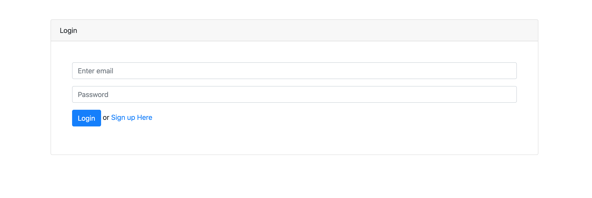
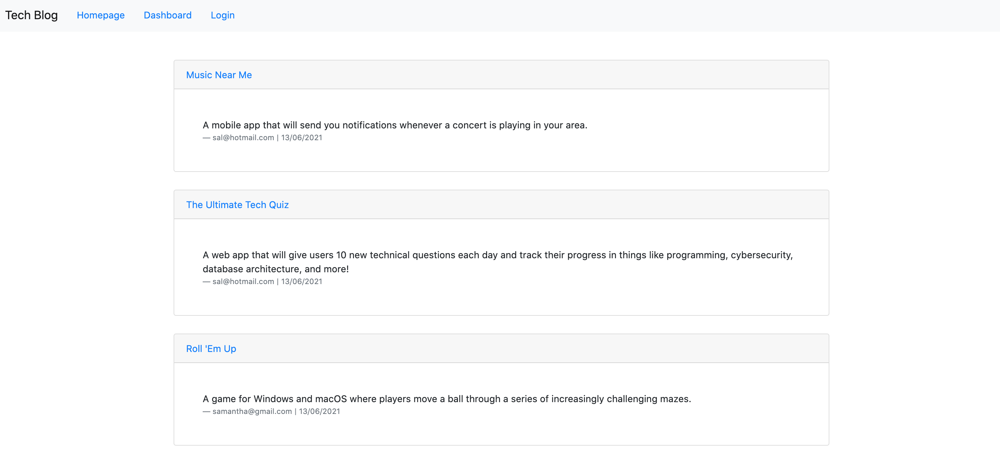
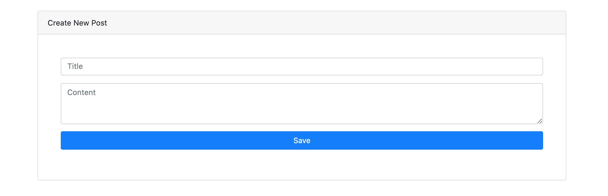
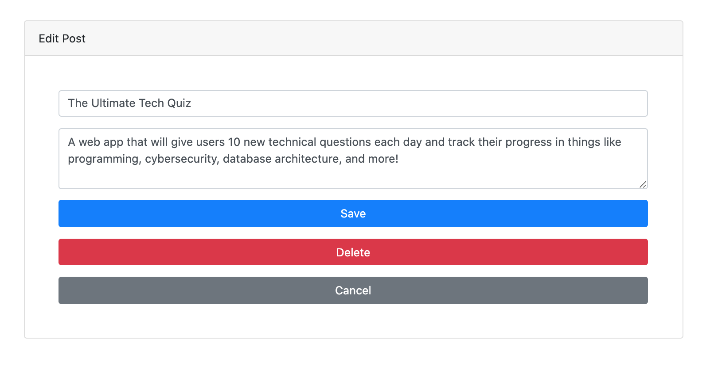
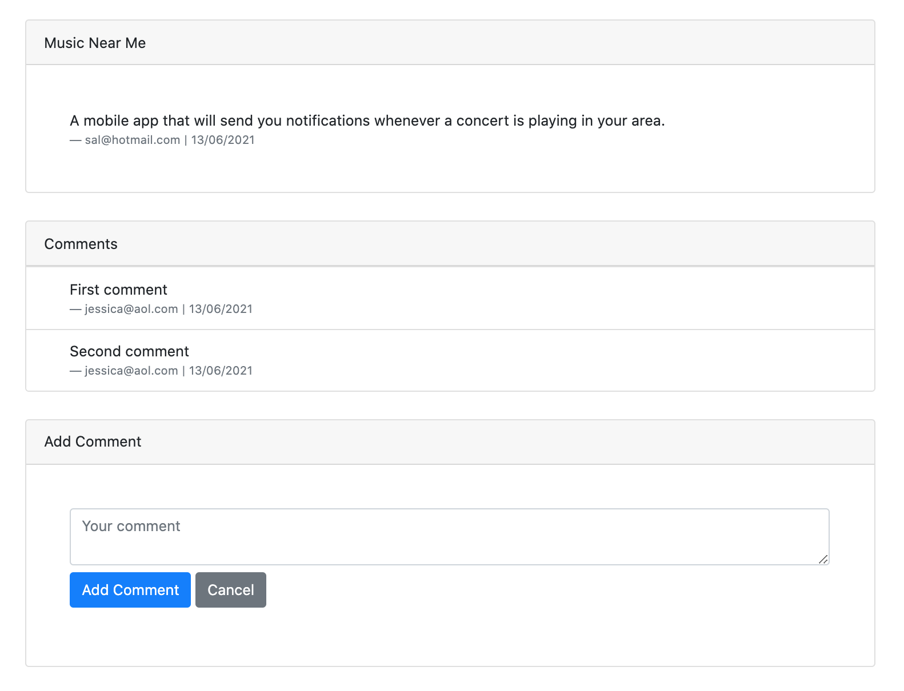

## Tech Blog
A simple web application that allows users to add new posts, edit posts or delete posts. It also lets users comments on existing posts that have previously been created by others.

# Usage
* To add/edit/delete/add comments, a user must first logged in or sign up to the application.

# Limitations
* No pretty messages when errors are encountered. Currently the error message is shown as alerts. This could be for future development.

# Deployment
This application is deployed in heroku: https://polar-eyrie-71376.herokuapp.com/

# Screenshots
Login Page

---
Homepage

---
Create New Post

---
Edit Post

---
View & Add Comments 

